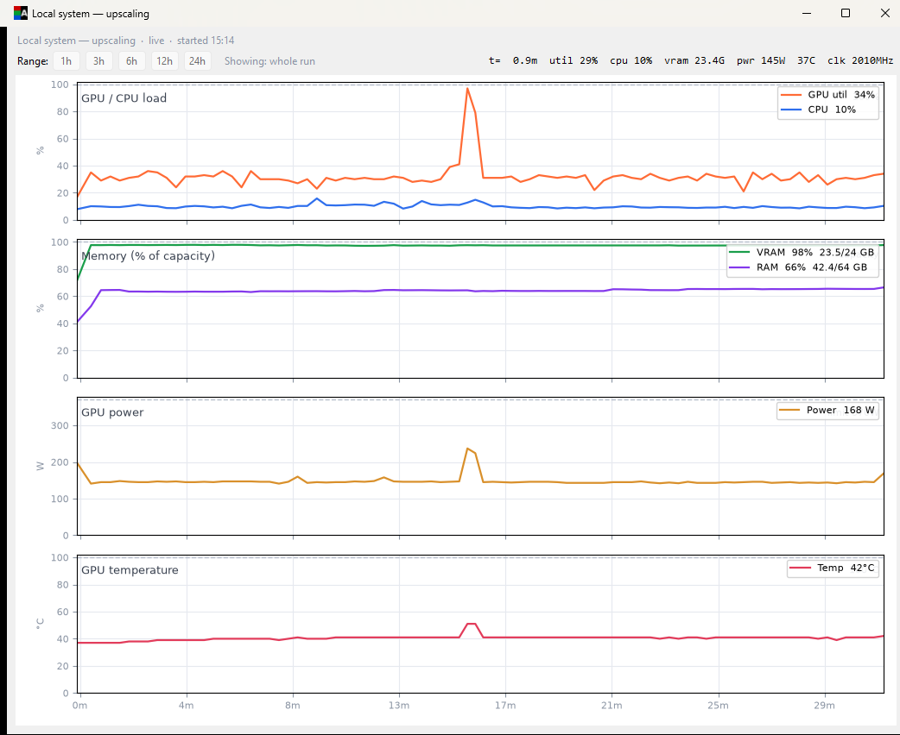

# Image Toolbox

### AI-leveraged image/video toolbox for Windows: **upscale** low-resolution photos and videos, and **describe & rename** pictures using local or remote upscaling and vision models. Built to revive personal photo/video collections and old footage and pictures taken with early digital cameras.
### ========
> ## ⚠️ The application is offered as-is.
> ### ⚠️ The author can't be held responsible for data loss.
> Always test on a small, disposable sample first. I am not responsible for data loss. Use this tool at your own risk.
> *(That said: the application never modifies your original images or videos, unless you specifically tell it to. Guardrails are put in place so that it is clear when (and how) your original data is modified.)*

Batch Upscaler runs the [SeedVR2](https://github.com/ByteDance-Seed/SeedVR) upscaling pipeline **directly in-process**. Image tagging uses [Ollama](https://ollama.com) vision models.
* Local work: *Everything runs on your machine.*
* Remote pods: *Images are sent via SSH to the remote pod **only**.*
* ***No data is sent to third parties without your knowledge.***
* ***All your data is under your direct control.***


---

## Contents

- [Install (Windows installer)](#install-windows-installer-recommended)
- [Run from source](#run-from-source)
- [The app](#the-app)
  - [Common features](#common-features)
  - [Batch Upscaler](#batch-upscaler)
  - [Tag & Rename](#tag--rename)
  - [Conciliation](#conciliation)
  - [Video Upscaler](#video-upscaler)
  - [Settings](#settings)
  - [Notifications](#notifications)
  - [Home Assistant (MQTT)](#home-assistant-mqtt)
- [Configuration](#configuration)
- [Remote GPU cost (RunPod)](#remote-gpu-cost-runpod)
  - [Remote Upscaling (Batch Upscaler)](#remote-upscaling-batch-upscaler)
  - [Remote Tag & Rename](#remote-tag--rename)
- [How it compares to other tools](#how-it-compares-to-other-tools)
- [Samples](#samples)
- [Notes](#notes)

---

## Install (Windows installer, recommended)

No Git, no Python knowledge required:

1. **Download** `ImageToolboxSetup.exe` from the [latest release](https://github.com/war4peace/image-toolbox/releases/latest).
2. **Run it** and click through the installer (no administrator rights needed).
3. **Double-click** the *Image Toolbox* shortcut.

The installer offers options to use it locally (taking advantage of your local, powerful GPU) or on a remote machine using RunPod.io infrastructure. ***Note:** I have no business relationship with runpod.io. The only (mutual) "advantage" (in a manner of speaking) is: when you create an account on RunPod from the application, my referral link is used. This gives both me and you an extra credit of 5 USD when you add at least 10 USD to your runpod account.*

The first launch opens a setup window that downloads the required components: Python, PyTorch with CUDA and the SeedVR2 engine (a remote-only install skips the local GPU stack, so it downloads far less), a GPL ffmpeg build (used by the Video Upscaler), a bundled libVLC (for in-app video playback with sound) and then starts the app. It also offers to install [Ollama](https://ollama.com) and the vision model used by **Tag & Rename** (optional. Local upscaling works without it, and you can decline). The first upscale process you run additionally downloads the AI upscaling model weights automatically. Everything the setup prints is saved to `bootstrap.log` in the application folder (useful for troubleshooting).

> **Windows SmartScreen note:** because the installer is a new, unsigned download, Windows may show *"Windows protected your PC: Unknown publisher"*. Click **More info → Run anyway**. The installer is built automatically from the public source in this repository by GitHub Actions; you can verify the build on the repository's **Actions** tab.

**Requirements:**

***Local* Upscaling / Tagging:**
* Windows 10/11 (64-bit)
* An NVIDIA GPU with current drivers (16 GB VRAM minimum)
* An internet connection
* Free disk space for the local GPU stack and the model weights, which are large (the tagging model, if you install it, is extra). (PyTorch ships its own CUDA runtime, so a separate CUDA Toolkit install is **not** required).

***Remote* Upscaling / Tagging:**
* Windows 10/11 (64-bit)
* An internet connection
* Modest free disk space (the Python runtime and the app's infrastructure; no local GPU stack, no model weights)
* A runpod.io account (which you can create via a link from the installer, or separately)

<div align="right"><a href="#image-toolbox">↑ Back to top</a></div>

---

## Run from source

If you'd rather run from the repository instead of the installer:

```powershell
# 1. Clone this repo and the SeedVR2 engine into it.
#    (The engine lives in a repo named "ComfyUI-SeedVR2..." but is used
#     directly in-process here: the ComfyUI application itself is NOT needed.)
git clone https://github.com/war4peace/image-toolbox
cd image-toolbox
git clone https://github.com/numz/ComfyUI-SeedVR2_VideoUpscaler seedvr2

# 2. Create the Python environment (Python 3.12, NVIDIA GPU required).
py -3.12 -m venv .venv
.venv\Scripts\python.exe -m pip install torch torchvision --index-url https://download.pytorch.org/whl/cu128
.venv\Scripts\python.exe -m pip install -r seedvr2\requirements.txt pillow piexif timm paho-mqtt python-vlc

# 3. Launch the GUI (the model weights download automatically on first use).
#    (In-app video playback also needs a libVLC 3.0.x build in a "vlc\" folder next
#     to the app; the GUI offers a one-click "Install libVLC now" if it's missing.)
.venv\Scripts\pythonw.exe scripts\toolbox_gui.py
```

Or just double-click **`Image Toolbox.cmd`** after cloning: it bootstraps the environment and launches the app for you.

You can also run the tools headless from PowerShell:

```powershell
.venv\Scripts\python.exe scripts\batch_upscale.py "X:\Your\Photos"               # upscale
.venv\Scripts\python.exe scripts\batch_upscale.py "X:\Your\Photos" "Z:\Output"   # custom output
.venv\Scripts\python.exe scripts\tag_and_rename.py "X:\Your\Photos"              # tag & rename
.venv\Scripts\python.exe scripts\conciliate.py "X:\Your\Photos" "Z:\Output"     # conciliate (archive)
.venv\Scripts\python.exe scripts\batch_video_upscale.py "X:\Your\Videos" --target 1080p         # video upscale (remote RunPod pod)
.venv\Scripts\python.exe scripts\batch_video_upscale.py "X:\Your\Videos" --local --target 4K    # video upscale (this machine's GPU)
```

The Video Upscaler runs on a rented RunPod GPU by default; add `--local` to upscale on your own GPU instead. `--target` (`1080p` / `1440p` / `4K`) scans the folder and enqueues every eligible video before running; omit it to process a queue you already prepared in the GUI. Like the image tools, it mirrors the source tree into an output subfolder and never touches your originals.

The GUI and the scripts share the same logs and cache database (`db/cache.db`), so you can mix and match freely.

<div align="right"><a href="#image-toolbox">↑ Back to top</a></div>

---

## The app

Windows GUI (mostly Python standard-library tkinter) with six tabs.

### Common features

- **First-start wizard:** on the first launch it detects your GPU and recommends the upscaling (SeedVR2) and tagging (Ollama) models that suit your VRAM, and offers to download the vision model in one click. Every model stays selectable (a smaller card can still run a bigger model, just slower). If your card can benefit, it also offers an **optional speed-up for local video** (`torch.compile`): it explains the download size and the trade-offs, installs the small Triton piece for you, and points you to Microsoft's page for the C++ build tools. It's optional and affects speed only, never quality. Re-run the wizard any time from **Settings → Re-run first-start wizard**.
- **One "Run on" row on every GPU tab** (0.5.8): the Batch Upscaler, Tag & Rename and Video Upscaler all pick where a run happens the same way, with a **Local GPU / Remote: RunPod** picklist and, next to it, a GPU picker for whichever you chose. Remote lists the live RunPod catalog with prices and stock; **local lists your own NVIDIA cards**, so on a multi-GPU machine you can send a run to a specific card and leave the other one free.
- **Update checker** makes sure you don't miss updates. Update straight from the app.
- **Tooltips everywhere:** every button, checkbox, picklist and setting has plain-language hover help; the money- or data-affecting controls lead with the consequence (e.g. Conciliation's *Delete* is not undoable, a rented pod bills by the second).
- **Telemetry rows** (for local and/or remote machine): CPU, RAM, VRAM, GPU temperature, and (0.5.3) **GPU utilization, power draw and core clock**. **Click any row to open a live, per-run usage graph**: four capacity-pinned charts (load, memory, power, temperature) with a movable crosshair readout. The timeline covers exactly the run (it starts when the first image/video is processed, not during the pre-scan), and freezes but stays browsable when the run ends.
- **Live feedback:** two-row status (current + previous file), a progress bar, and an estimated time remaining that refreshes after each image. The Windows taskbar button mirrors the progress and flashes for attention when a run finishes or a problem is detected, so an unattended run still catches your eye.
- **Live preview**: Batches of 100 images are loaded into a "preview" pane, allowing you to open images, perform a live comparison (upscaled images), context menu (right-click images) with common actions.
- **Resizable thumbnails** in the film strip area.
- **Notification support**: Currently supports *Discord*, *Telegram*, *ntfy.sh* and a *Home Assistant webhook*.
- **MQTT integration** (e.g. for Home Assistant, see **Home Assistant (MQTT)** section below).



*The per-run telemetry graph (click a telemetry row to open it): GPU/CPU load, memory against capacity, power and temperature over the run, with a crosshair readout.*

<div align="right"><a href="#image-toolbox">↑ Back to top</a></div>

### Batch Upscaler

- **High-quality image upscaling** with SeedVR2, prioritising quality over speed. The target is capped at 3840 × 2160 by default (a **Resolution Target** of 4K, 2K or 1080p is selectable in Settings), so results display at native resolution on common screens.
- **Your originals are never touched.** Upscaled images are written to a separate output folder that mirrors the source folder tree and filenames.
- **Auto-straighten** (on by default): a small CNN detects sideways photos and rotates them upright *before* upscaling, so the result fits the Resolution Target on the correct axis (a sideways photo upscaled on the wrong axis stops fitting once it's turned upright). It works on a temp copy, so the source is never touched; only confident calls act, and ambiguous ones are left alone. Toggle it and tune the threshold in **Settings → Batch Upscaler**.
- **The original's details come along.** The upscaled photo keeps the capture date, camera, lens, exposure, GPS and copyright from the original, so your collection still sorts by when the picture was taken rather than when the file was written. The sideways-photo tag is corrected (the pixels are already upright, so leaving it would rotate the photo twice in your viewer) and the tiny stale preview thumbnail is dropped. Turn it off in **Settings → Batch Upscaler** if you deliberately want scrubbed copies to share, with no GPS and no camera.
- **Skip-cutoff:** images already close to the target are skipped (default 66% of the target on either axis, i.e. anything that would gain less than ~1.5×). Set it to 0 in Settings to upscale everything eligible.
- **Images that cannot be upscaled without losing something are left alone.** The upscaler works in plain 8-bit colour, so it cannot keep transparency (a see-through PNG or WebP), the extra pages of a multi-page TIFF, or 16-bit colour depth. Rather than hand you back a flattened copy under the same name, the tool skips these files, tells you why ("would lose transparency"), and lists each one at the end. Conciliation will never replace them either, including files you upscaled before this was added.
- **Resilient long runs:** a cache (in the local SQLite database `db/cache.db`) lets a stopped batch resume where it left off; corrupt and missing files are detected, logged and skipped (corrupt files are listed at the end so you can review them); a **second pass** re-scans the source when the batch finishes and processes anything new that appeared while it ran.
- **Pause / resume / stop** buttons; a stop finishes the current image first so a file is never left half-written. **Pausing hands the graphics card back** (0.5.2): it unloads the AI models and frees the VRAM (measured ~16.6 GB on an RTX 3090) so you can use the card for something else, then reloads on Resume with the queue intact.
- **Degraded-GPU watchdog:** long GPU sessions can silently slow to a crawl (a known driver/VRAM issue that only a reboot cures, unrelated to this app). The run watches its own throughput and, on a sustained slowdown or an out-of-memory, cleanly stops after the current image and alerts you; the resume cache continues the queue after a reboot.
- **Log window**: Displays more detailed information in a separate window.
- **Works with mapped network drives.**

<div align="right"><a href="#image-toolbox">↑ Back to top</a></div>

### Tag & Rename

Analyses each image with a local or remote Ollama vision model, writes a description into EXIF, and renames the file to `OriginalName_Condensed_Description.ext`.
- **Which folder to pick:** if you upscaled first, point this at the **upscaled** folder (`__upscaled__` by default), not at the original photos. Tag & Rename is step 2 of *upscale → tag → conciliate*, so the descriptions and names belong on the copies that will replace your originals. The tab pre-fills the field for you, using (in order) your saved Tag & Rename folder, then whatever the Batch Upscaler tab has in **Save upscaled to**, then the saved Batch Upscaler output folder. Press **Save as Default** to pin your own choice. Folders the app created itself are skipped inside a scan, but choosing one *as* the folder always works.
- **Auto-straighten** (on by default): a small local CNN detects photos shot with the camera held sideways and rotates them upright *before* tagging, which also improves the descriptions. Only confident calls are acted on; upside-down and ambiguous images are left alone and logged, so a photo is never wrongly rotated. Toggle it and tune the confidence threshold in **Settings**; rotations are reverted by **Undo** like everything else.
- **Selectable description language**, plus force-tag / force-rename options.
- **One-click Undo** restores file names, EXIF descriptions, or both. Every change is recorded to an undo cache before anything is modified.
- **Pause / Resume** (0.5.2): pausing a local run unloads the vision model to free VRAM, and Resume reloads it and continues. The same button doubles as *Resume after error* when a run is held because the model kept failing.
- Already-tagged files are detected and skipped on re-runs (unless forced, optional).
- **The vision model is your choice** (set it in **Settings**). The default (0.5.5) is [`qwen3-vl:8b-instruct`](https://ollama.com/library/qwen3-vl): the clearest and most detailed of the models tried, needing ~10 GB VRAM. On a smaller card the first-start wizard suggests a lighter model from the same family: [`qwen3-vl:4b-instruct`](https://ollama.com/library/qwen3-vl) (~8 GB) or [`qwen3-vl:2b-instruct`](https://ollama.com/library/qwen3-vl) (~6 GB). Every model stays selectable, so you can pick a heavier or lighter one knowingly.

**Vision-model benchmark** (RTX 3090, 100 photos, `num_ctx = 8192`; quality is a subjective 1–5 read of the descriptions and filenames):

| Model | Runtime | Peak VRAM (of 24 GB) | Quality (1–5) |
|---|--------:|---------------------:|:-------------:|
| **qwen3-vl:8b-instruct** *(default)* | 2:37 | 43% | **5** |
| qwen3-vl:4b-instruct | 1:42 | 32% | 4 |
| qwen2.5vl:7b *(previous default)* | 2:37 | 39% | 4 |
| ministral-3:8b | 2:15 | 44% | 3 |
| qwen3-vl:2b-instruct | 1:26 | 25% | 3 |
| gemma3:4b | 2:25 | 24% | 3 |

The qwen3-vl family led at every size. Two others were tested and rejected: `minicpm-v4.6` (quality 2, leaks its reasoning into the description and filename) and `qwen2.5vl:3b` (quality 1, broken output). Full scoring notes and per-model comments are in [`docs/tag-and-rename.md`](/docs/tag-and-rename.md) (raw data: [`docs/tag-rename-benchmarks.csv`](/docs/tag-rename-benchmarks.csv)).

> **Why `num_ctx` matters:** uncapped, qwen3-vl declares a 256K context and Ollama sizes its KV cache off that, grabbing almost the whole card and thrashing (the 8B model ran 9:11 at 98% VRAM). Capped at 8192 the same run is 2:37 at 43% VRAM, with no quality loss. Image Toolbox applies this cap automatically.

<div align="right"><a href="#image-toolbox">↑ Back to top</a></div>

### Conciliation

Once you're happy with the upscaled (and optionally tagged & renamed) results, **Conciliation** moves them back into your original folder tree so the originals are replaced by their high-quality versions. No manual shuffling required. It handles **photos and videos**.

- Pick an **Original Files** folder and a **Processed Files** folder, then **Scan / Preview**. Nothing is touched until you click **Run**: the preview shows a per-folder summary (how many will be *replaced*, how many files have *no match*, and how many non-media files are *kept*).
- Each original is matched to its processed counterpart using the cache database, falling back to filename matching when there's no cache. It works for upscaled-only, upscaled-then-tagged/renamed, and upscaled videos.
- Two operations: **Archive originals** (default; moves each original into an `__Archive__` subfolder) or **Delete originals** (permanent, with an extra confirmation). The processed file then takes the original's place, keeping its own name (a photo's descriptive name if it was tagged, or a video's `name_4K.mp4` output name).
- **Videos too:** a video original (e.g. `clip.avi`) is matched to its upscaled output (e.g. `clip_4K.mp4`) by content-hash lineage, so it still matches after folders are moved or renamed. A video is only ever acted on when its output is actually present in the Processed folder you chose, so pointing Conciliation at a photo-only output folder never touches your videos (and vice versa) and the preview always shows exactly what will happen first.
- **Missing details are put back first.** If you upscaled photos before the app started copying metadata, this is the last moment both files exist: before archiving or deleting an original, Conciliation copies into the upscaled version every field it is missing (capture date, camera, GPS) and changes nothing it already has, including the description Tag & Rename wrote. The preview tells you how many will be repaired, and repairs nothing itself.
- **Safety first:** an original with no processed counterpart is never touched, and non-media files are never touched. Neither is an image the upscaler cannot reproduce exactly (transparency, several pages, 16-bit): the preview counts these under *no match*, and the log names each one with the reason. After a run, emptied processed folders (e.g. a leftover `__upscaled__`) are cleaned up. The tab is locked while the Batch Upscaler or Tag & Rename is running, since they may share the same folders.

<div align="right"><a href="#image-toolbox">↑ Back to top</a></div>

### Video Upscaler

Upscales a folder of videos with the same SeedVR2 engine the Batch Upscaler uses, either on a **rented RunPod GPU** (fast, paid) or on **your own local GPU** (free, slower). Video means a diffusion pass per output frame, so remote could offer access to powerful GPUs which greatly reduce processing time; local is there so anyone with a capable GPU can do it at no cost, except power usage. Your source videos are never modified.

- **Two upscaling engines (0.5.6):** a **Method** switch picks **SeedVR2** (generative, highest quality, slow) or **Real-ESRGAN** (fixed 2× / 4× ratio, much faster, lighter on VRAM). Real-ESRGAN offers two model tiers, *Compact* (fastest) and *Quality*, and runs both locally and on a rented pod. Each queued job carries the engine and GPU you picked for it, so a mixed queue is grouped and run across the right cards, one pod per engine + GPU. Real-ESRGAN's smaller models let the remote pod self-download them (no model volume needed).
- **Run locally or remotely:** a **Run on** switch picks Remote (a rented RunPod card, billed by the second) or Local (this machine's NVIDIA GPU). The same walk, split, resume, mux and drift-check pipeline runs either way; only where the GPU work happens changes. The switch follows your install type (a Remote-only install can't run locally, and vice versa).
- **Scan, queue, go:** scan a folder, filter the list (by path, resolution, duration, FPS or a combined set), pick a target per video, build a queue, pick a GPU, press Start. Targets are offered as concrete output resolutions and filtered to what the source can be upscaled to **and** what the chosen GPU can actually reach: low-resolution sources get **2× / 4×** options (e.g. 320×240 → 640×480, 1280×960), and a target a small card would run out of memory on is not offered (locally) or greys out in the queue (remotely, with Start refused if nothing fits the chosen pod).
- **Extract a scene:** for a long source you don't want to upscale in full, mark an in/out range on a live preview and queue just that clip. The source is never touched (the clip is cut to a temp file, upscaled, then reassembled), and each clip resumes independently like a whole video.
- **Cost estimate + confirm-before-rent:** the estimated duration and cost for the whole queue is shown *before* any pod is rented, and the estimator improves itself from your own finished runs. ***Note:*** *Estimates start rough and sharpen as you run; benchmarking your GPU (below) makes them accurate.*
- **Benchmark your GPU (local or remote):** a one-click **Benchmark GPU** window measures, for a specific card, the largest batch size that fits at each target and the card's real per-frame speed, by upscaling a short clip at rising batch sizes until it runs out of memory. Those measurements replace the built-in guesses: the automatic batch sizing, which targets are offered, and the duration/cost estimate are all calibrated to your actual card. It benchmarks **your own GPU** or a **rented pod** (deployed just for the benchmark, billed while it runs, torn down afterwards), and it is resumable: every measured step is saved, so you can stop and continue, and each card is measured only once.
- **Shared benchmarks (0.5.1):** measured cards are pooled into a community set on GitHub, downloaded automatically at launch so a card someone else already measured is **not** re-swept locally (a sweep is slow, and on a rented pod, billed). You can contribute your own measured cards back with one click: a pre-filled GitHub issue via your existing GitHub login, no tokens or setup.
- **Survive losing a pod (opt-in):** tick **Auto-resume** and a long remote run rides out losing its pod mid-run: it reconnects a briefly-dropped pod, or waits (no charge while waiting) for the identical card to come back in stock and redeploys it, continuing from the first unfinished segment. A funds cap, your Stop, or a finished queue are the only things that end it.
- **Pay in installments:** each video is split into ~1-minute segments and every finished segment is progress saved. Stop any time; the next Start resumes at the first unfinished segment. Optional per-run minute / dollar caps keep a long job on budget.
- **The original audio is kept** (muxed back into the upscaled result), and a drift check warns if the output timing ever diverges from the source.
- **High-quality deliverable:** H.265 10-bit by default (selectable in Settings), written to a mirrored `__upscaled__` output tree.
- **Compare, two ways:** a **Compare frames** window (before/after wipe with shared zoom/pan, timestamp-aligned scrubbing and frame stepping) for pixel-peeping, and a **Play videos** window that plays the original and the upscaled result **side by side, in real time, with sound** (via a bundled libVLC), so you can judge motion and temporal quality, not just single frames.
- **Auto-tuned:** you pick the target and the GPU; batch size, temporal overlap and the remaining SeedVR2 knobs are resolved for the card's actual VRAM, with automatic out-of-memory recovery. A choice of SeedVR2 models (7B / 3B variants) is available in Settings.
- **Local runs are guarded, not gated:** on your own GPU the batch is sized predictively from your card's VRAM (so it fits on the first try), targets that would run out of memory aren't offered, a watchdog stops a run that starts thrashing a long GPU session (the Benchmark GPU tool above measures its real safe batch and speed). For best results, close other GPU-heavy apps before a local run.

Video upscaling is compute-heavy: as a rough guide, one hour of footage upscaled to 1080p costs about $28-46 of GPU time on a rented card (the in-app estimator shows the real numbers for your queue before you commit), or nothing but time and power usage on your own GPU. Remote runs require a RunPod account, like the other remote features; local runs need an NVIDIA GPU with a CUDA build of PyTorch.

<div align="right"><a href="#image-toolbox">↑ Back to top</a></div>

### Settings

Most of what is used to require hand-editing `config.json` is here:

- **Ollama URL** with a reachability check, and a **model** picklist populated from the models installed on your machine.
- **Auto-straighten** toggle and confidence threshold for Tag & Rename.
- **Resolution Target** (4K / 2K / 1080p) and the **skip-cutoff** percentage.
- **SeedVR settings** (attention mode, VAE tiling, outage threshold).
- **Discord webhook**, **Telegram bot** and **ntfy** notifications, each with a **Test** button (Telegram also has a **Detect** button to find your chat ID).
- **Default folders** for each tool, also settable from each tab's *Save as Default* button.
- **MQTT** settings (host, port, credentials, test button, manual publish button)
- **Update checker** settings.
- **Video Upscaler** settings: deliverable codec/quality, SeedVR2 model, and the advanced tuning knobs (best left on Auto).

Changes take effect only on **Save**: a live **"Not saved"** indicator turns red the moment a field differs from the saved state, and leaving the tab (or closing the app) with pending edits prompts you to Save, discard or cancel, so you never lose settings by accident.

Remote (RunPod) settings - the API key, region/data center, model volume, GPU preferences and pod management - live on the dedicated **RunPod** tab.

> **Secrets never touch `config.json`.** The API key, MQTT password and notification tokens/webhook URLs are stored in an untracked `config.local.json` overlay; `config.json` keeps only blank placeholders, so it is safe to share or commit without scrubbing. (Personal **Default folders** and non-secret fields like your MQTT host still live in `config.json`; clear those by hand if you want a pristine template to share.)

<div align="right"><a href="#image-toolbox">↑ Back to top</a></div>

### Notifications

Get a message when a queue finishes (for both the Upscaler and Tag & Rename) and on errors (repeated failures, an engine that fails to start, Ollama going unreachable). Four backends, configured in Settings → Notifications, all optional and independent:

- **Discord**: paste a channel **webhook** URL.
- **Telegram**: create a bot with **@BotFather**, paste its **bot token**, open the bot and press **Start**, then click **Detect** to fill in your chat ID.
- **ntfy**: make up a **topic** name, subscribe to it in the [ntfy](https://ntfy.sh) app, and enter it here (the **server** defaults to the public `https://ntfy.sh`; point it at your own server if you self-host). On the public server anyone who knows the topic can read it, so pick an unguessable name.

- **Home Assistant webhook** (0.5.8): for a Home Assistant user with **no MQTT broker**. Add an automation with a **Webhook** trigger, invent a webhook ID, and enter that ID plus your Home Assistant address here; each alert arrives as JSON your automation can do anything with. If you *do* run a broker, prefer the MQTT integration below: it reports far more, including if the app crashes mid-run.

Each has a **Test** button. Whatever you configure (any combination, or none) receives the same alerts, tagged with a severity: green finished cleanly, orange/yellow needs a look, red failed. On ntfy that severity also sets the notification's **priority**, so a failed run buzzes harder than a completed one.

Which to pick, the full setup steps, and what each alert contains: [`docs/notifications.md`](/docs/notifications.md).

<div align="right"><a href="#image-toolbox">↑ Back to top</a></div>

### Home Assistant (MQTT)

Optional. Set an MQTT broker **host** in Settings → MQTT and the app publishes its state to your broker: version and update status, availability, live task state (what it's doing, progress, ETA, per-item timings), the last-run summary, and system telemetry for this machine and, during a remote run, the rented pod: CPU, RAM, VRAM, GPU temperature, and (0.5.3) **GPU utilization, power draw and core clock**. Clear the host to disable it.

Ready-made Home Assistant content is included under [`samples/home-assistant/`](/samples/home-assistant/): [`mqtt-sensors.yaml`](/samples/home-assistant/mqtt-sensors.yaml) defines every published topic as a Home Assistant MQTT sensor (local and remote-pod), two paste-ready dashboards, a **core** one built only from Home Assistant's built-in cards (no HACS) and a richer **custom** one using named HACS cards, and (0.5.8) [`automations-ui.yaml`](/samples/home-assistant/automations-ui.yaml): five paste-ready automations for Home Assistant's automation editor: notify me when a run finishes, when it finishes badly, and when the app dies mid-run. See that folder's [README](/samples/home-assistant/README.md) for the install order.

State topics are **retained** (so a dashboard is correct right after a Home Assistant restart), which makes them poor triggers: a retained value is re-delivered on every restart and reconnect. So a run start and a run end are *also* published as one-shot, **non-retained** events (`image-toolbox/event/run_started` / `run_finished`, the latter carrying the same summary as `last_run`). Trigger automations on those; read the retained topics for state. The full topic contract and the per-tool run-summary keys are documented in [`docs/mqtt-integration.md`](/docs/mqtt-integration.md).

<div align="right"><a href="#image-toolbox">↑ Back to top</a></div>

---

## Configuration

Settings live in `config.json` next to the app, with these sections:

| Section    | What it holds                                                        |
|------------|----------------------------------------------------------------------|
| `seedvr2`  | Paths to the engine repo, model weights, and the venv Python.        |
| `ollama`   | Ollama server URL and the vision model for tagging.                  |
| `upscale`  | Resolution target, skip-cutoff, SeedVR pipeline options.            |
| `tagging`  | Resolution threshold, timeouts, camera-filename patterns, etc.       |
| `defaults` | Pinned default folders for each tool.                                |
| `mqtt`     | Home Assistant / MQTT broker host, port, credentials, client id.     |
| `updates`  | In-app update-checker preferences.                                   |
| `runpod`   | Remote-pod settings: GPU/region/volume prefs and pod-management limits. |
| `video`    | Video Upscaler deliverable codec/quality and SeedVR tuning knobs.    |
| `notifications` | Discord webhook, Telegram bot token/chat ID, ntfy server/topic, Home Assistant URL + webhook ID. |

You normally never edit this file by hand; use the **Settings** tab. The installer never overwrites your `config.json` on upgrade, and removes it only on a full uninstall.

**Secrets are kept out of `config.json`.** The RunPod API key, MQTT password and notification tokens/webhook URLs live in an untracked `config.local.json` next to it (created automatically the first time you save settings); `config.json` itself only ever holds blank placeholders for those fields, so it is safe to share.

<div align="right"><a href="#image-toolbox">↑ Back to top</a></div>

---

## Remote GPU cost (RunPod)

If your PC has no capable NVIDIA GPU, the toolbox can run a batch on a rented [RunPod](https://runpod.io) GPU instead (set *Run on* to *Remote: RunPod* on the tab). It rents a pod, streams one image at a time, fetches the results back, and tears the pod down upon completion. Your source files are always copied, not moved, to the remote pod. The tables below estimate what a run costs.

The figures below come from benchmarking a 100-image sample of typical digital-camera photos through the in-app remote-pod runner, on RunPod secure cloud (EU region, June 2026), across roughly fifteen GPUs. `~sec/img` and `$/100` are whole-run averages over the 100 images (they include the one-time model load on the first image, so larger runs cost a little less per image). Where a card was benchmarked more than once, the figures average its valid runs (any run flagged degraded by the performance watchdog is left out). Upscaling figures use the resident-VRAM offload added in 0.3.5, where the SeedVR2 models stay in GPU memory for the whole run, and reflect the most demanding case: upscaling to the 4K Resolution Target with the 7B FP16 model (a lower target of 2K / 1080p, or a lighter 3B model, is faster and cheaper, so treat these as an upper bound).

### Remote Upscaling (Batch Upscaler)

| GPU | $/h | ~sec/img | $/100 images |
|-----|----:|---------:|-------------:|
| **NVIDIA A40** *(best value)* | 0.44 | 15.7 | **$0.19** |
| NVIDIA RTX A6000 | 0.49 | 14.3 | $0.19 |
| RTX 5090 † | 0.99 | 12.9 | $0.36 |
| **RTX PRO 6000 Blackwell** *(fast pick)* | 2.09 | 7.5 | $0.44 |
| A100 80GB PCIe | 1.39 | 13.8 | $0.53 |
| A100 80GB SXM4 | 1.49 | 13.7 | $0.56 |
| H100 80GB HBM3 | 3.29 | 8.8 | $0.81 |
| **NVIDIA B200** *(fastest)* | 5.89 | 5.9 | $0.96 |
| NVIDIA H200 | 4.39 | 7.9 | $0.96 |

† The RTX 5090 (32 GB) cannot hold both models resident, so it runs in the slower CPU-offload mode, yet it stays the best value among sub-40 GB cards.

**Findings:** The mid-VRAM Ampere cards (A40, A6000 at about $0.19 per 100 images) are the value winners: slower per image than a 5090 but far cheaper per hour, and the resident-VRAM offload is what makes them viable. For raw speed the B200 leads (5.9 sec/img) but at five times the cost, while the **RTX PRO 6000** is the sane fast pick, beating both Hopper cards (H100, H200) at a fraction of their price. The two A100 80GB variants land mid-pack at ~13.8 sec/img (the PCIe a touch cheaper per 100 than the SXM4): capable but unremarkable for upscaling, since the cheaper Ampere cards are far better value and the newer cards are far faster. SeedVR2 upscaling rewards newer architectures: Blackwell over Hopper over Ampere on raw speed.

<div align="right"><a href="#image-toolbox">↑ Back to top</a></div>

### Remote Tag & Rename

> **⚠️ These figures are obsolete (as of 0.5.5).** They were measured with the previous default vision model, [`qwen2.5vl:7b`](https://ollama.com/library/qwen2.5vl), which has been **superseded by [`qwen3-vl:8b-instruct`](https://ollama.com/library/qwen3-vl)** (see the [Tag & Rename benchmark](#tag--rename) above). They are kept only as a rough guide. The new model ran at essentially the same speed *locally* (~identical seconds per image), so per-run costs should be close, but the table below has **not** been re-measured on remote GPUs yet. Fresh remote benchmarks with `qwen3-vl:8b-instruct` are planned.

| GPU | $/h | ~sec/img | $/100 images |
|-----|----:|---------:|-------------:|
| **NVIDIA RTX A4500** *(best value)* | 0.25 | 3.5 | **$0.025** |
| NVIDIA RTX 2000 Ada | 0.24 | 5.8 | $0.039 |
| RTX PRO 4000 Blackwell | 0.57 | 6.0 | $0.10 |
| RTX PRO 4500 Blackwell | 0.74 | 4.7 | $0.10 |
| RTX PRO 6000 Blackwell | 2.09 | 2.7 | $0.16 |
| A100 80GB PCIe | 1.39 | 4.6 | $0.18 |
| **H100 80GB HBM3** *(fastest)* | 3.29 | 2.4 | $0.22 |
| NVIDIA H200 | 4.39 | 2.6 | $0.32 |
| NVIDIA B200 | 5.89 | 3.2 | $0.53 |

**Findings.** Tagging is light: the vision model needs only ~6.6 GB, so the big datacenter cards are wildly overprovisioned and barely faster. The fastest card (H100, 2.4 sec/img) is only about 13% quicker than the RTX A4500 yet costs 13 times as much per hour. Pick a cheap card: an **RTX A4500** or **RTX 2000 Ada** tags 10,000 photos for around $2.50. (Tag & Rename also runs on a local GPU at no GPU cost: a local RTX 3090 tagged 100 photos in under six minutes.)

> **Caveats:** prices are point-in-time and vary by availability and region (the in-app GPU picker shows live prices). The estimates exclude the billed pod boot/teardown (~2 to 3 minutes) and the image upload/download time, so real bills run a little higher, most noticeably on very small runs. Source data: [`docs/image-benchmarks.csv`](/docs/image-benchmarks.csv).

<div align="right"><a href="#image-toolbox">↑ Back to top</a></div>

---

## How it compares to other tools

### Upscayl

[Upscayl](https://github.com/upscayl/upscayl) is the best-known free AI image upscaler, and it is a good tool. If you want to upscale a handful of images, on a Mac / on AMD / on Linux, right now, with minimum ceremony, **use Upscayl**: it runs Real-ESRGAN class models through ncnn + Vulkan, so it works on any Vulkan-capable GPU on Windows, macOS and Linux, and it has a large model library, custom-model import and a CLI.

Image Toolbox is a different shape of tool. It is NVIDIA-only and Windows-only, and upscaling is one of four tools rather than the product. What it adds is everything around a *collection*: video upscaling, vision-model tagging and renaming, replacing the originals with the processed results, resumable multi-thousand-file runs, renting a cloud GPU by the second when the local one is not enough, and home-automation / notification integration. It also runs **SeedVR2**, a diffusion upscaler, alongside Real-ESRGAN.

So: 40,000 family photos and a shelf of old camcorder footage, unattended and restartable, is the job this was built for.

**[Full feature-by-feature comparison: `docs/upscayl-vs-image-toolbox.md`](/docs/upscayl-vs-image-toolbox.md)**, including a section on where Image Toolbox is honestly the weaker tool, and one on using both together (Image Toolbox for the pipeline, Upscayl for the one-off).

### Topaz Gigapixel and Topaz Video

The commercial reference products are worth comparing against too, and the honest summary is that they offer far more control and far more scope. **[Topaz Gigapixel](https://www.topazlabs.com/topaz-gigapixel)** has nine model families, face recovery, corrective sliders for noise / blur / compression, automatic per-image model choice, RAW input, Photoshop and Lightroom plugins, and it runs on AMD, Intel and Apple GPUs at a 6 GB VRAM floor. **[Topaz Video](https://www.topazlabs.com/topaz-video)** does eight things Image Toolbox does not do at all (denoise, sharpen, stabilise, frame interpolation, slow motion, motion deblur, grain, SDR to HDR), exports ProRes and FFV1, goes past 4K, and scales across multiple GPUs. Which tool upscales a given photo or clip more attractively is a separate question that these comparisons deliberately do not answer: no side-by-side test was run, and the answer varies by source and by taste. Try both on your own files.

What Image Toolbox adds is the collection layer and the cost layer: a recursive tree walk with a mirrored output, segment-level resume so a multi-day queue is banked minute by minute, renting a specific cloud GPU by the second with an estimate and a spending cap, surviving the loss of that GPU mid-run, tagging and renaming, and conciliating the results back over the originals. It is also free, needs no account, and both Topaz products are subscription-only since October 2025.

**Full comparisons: [`docs/topaz-gigapixel-vs-image-toolbox.md`](/docs/topaz-gigapixel-vs-image-toolbox.md)** and **[`docs/topaz-video-vs-image-toolbox.md`](/docs/topaz-video-vs-image-toolbox.md)**, each with the same honest-weaknesses and use-them-together sections.

<div align="right"><a href="#image-toolbox">↑ Back to top</a></div>

---

## Samples

The [samples](/samples/) folder contains [original images](/samples/original/) and their [upscaled](/samples/upscaled/) versions, so you can compare pairs side-by-side and judge the upscaler's strengths and weaknesses. It also holds the [Home Assistant dashboard samples](/samples/home-assistant/) (see the Home Assistant section above).

<div align="right"><a href="#image-toolbox">↑ Back to top</a></div>

---

## Notes

- **About the code:** these tools were written with the help of Claude (Anthropic) by someone who is not a trained developer ("vibecoding", as some call it). This is a personal project, shared for anyone to use at no cost.
- **Maintainers:** the installer is built by the `build-installer` GitHub Actions workflow from `installer/ImageToolbox.iss` whenever a `v*` tag is pushed.

<div align="right"><a href="#image-toolbox">↑ Back to top</a></div>
