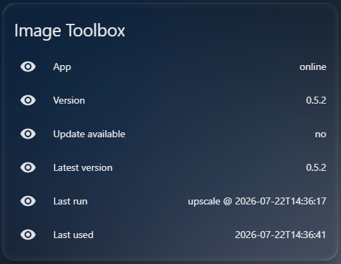
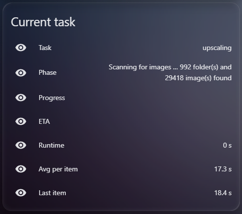
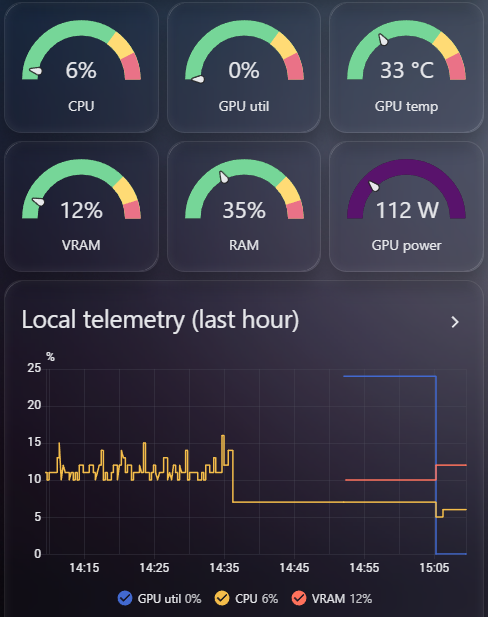
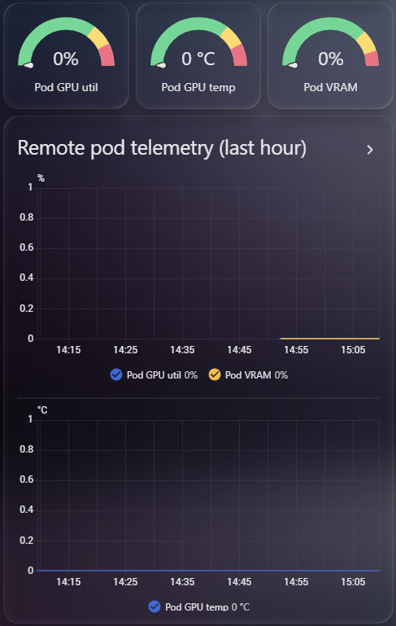
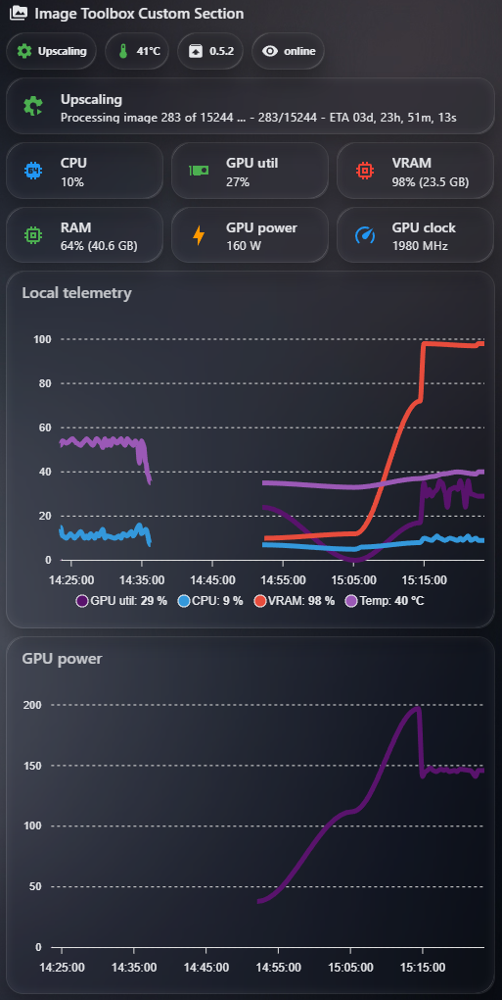

# Image Toolbox - Home Assistant samples

Ready-made Home Assistant content for anyone running **both** Home Assistant and
Image Toolbox. The app already publishes its state to MQTT (see the main README's
**Home Assistant (MQTT)** section); these files turn those topics into sensors and
two ready-to-paste dashboards.

Two tiers:

- **`dashboard-core.yaml`** - built only from Home Assistant's **built-in**
  Lovelace cards. Works on any install, no HACS, nothing to download.
- **`dashboard-custom.yaml`** - the same information with a nicer status header,
  band-coloured metric tiles and real time-series graphs, using a small set of
  named **HACS** custom cards.

## Prerequisites

1. An **MQTT broker** and the Home Assistant **MQTT integration** configured.
2. Image Toolbox pointed at the same broker: **Settings > MQTT**, set the broker
   host (and credentials), press **Test**, then **Save**. Clearing the host
   disables publishing.

## Install order

Add the entities first, then a dashboard.

1. **MQTT sensors** - [`mqtt-sensors.yaml`](mqtt-sensors.yaml): every published
   topic as a Home Assistant MQTT sensor (local machine and remote pod). Add it
   under the MQTT `sensor:` block in your `configuration.yaml` (or a file you
   already `!include`), then restart Home Assistant.
2. **Derived percentages** - [`template-sensors.yaml`](template-sensors.yaml):
   the app publishes RAM and VRAM as raw **MB** on purpose, so these template
   sensors compute `used / total * 100` for the gauges. Add under a top-level
   `template:` key and reload template entities (or restart). *Only needed for the
   dashboards' RAM/VRAM gauges; CPU and GPU utilization are already percentages.*
3. **A dashboard card** - each dashboard file is **one card** (a vertical stack),
   pasted into a single card's code editor. This is deliberate: editing the whole
   dashboard's raw YAML is risky, so you never touch it.
   1. Open your dashboard and click **Edit dashboard** (top-right pencil).
   2. Click **+ ADD SECTION**, then **+ ADD CARD** inside it and pick any card
      (a **Heading** is fine as a placeholder).
   3. In that card's editor, click **Show code editor**, select all, and paste
      the whole contents of [`dashboard-core.yaml`](dashboard-core.yaml) **or**
      [`dashboard-custom.yaml`](dashboard-custom.yaml) (everything from
      `type: vertical-stack` down). **Save**.

   To have both tiers, repeat with a second card. You can also lift any single
   sub-card out of the file into its own card.

## HACS cards (custom dashboard only)

Install from **HACS > Frontend**. A minimal set is Mushroom + ApexCharts.

| Card | Repo | What it adds |
|------|------|--------------|
| Mushroom | `piitaya/lovelace-mushroom` | status chips + band-coloured metric tiles |
| ApexCharts card | `RomRider/apexcharts-card` | real time-series telemetry graphs |
| card-mod *(optional)* | `thomasloven/lovelace-card-mod` | extra styling hooks |
| auto-entities *(optional)* | `thomasloven/lovelace-auto-entities` | auto-list every `sensor.image_toolbox_*` |

Custom-card versions drift over time; if a card looks off, check its repo for a
config change (captured here as of 2026-07).

## What updates when

- **`system/*`** (this machine) updates only **while a task runs**, plus a slow
  60 s idle sample. Between runs the values hold their last reading.
- **`system/remote/*`** (the rented pod) exists **only during a remote-pod run**
  and is zeroed when the pod is torn down. The dashboards' remote panel hides
  itself when there is no active pod.
- So **gaps in the history graphs are normal**, not a fault - the app is not a
  24/7 sensor, it reports while it works.

## Topic reference

All under the base topic `image-toolbox/`:

| Topic | Meaning |
|-------|---------|
| `version` / `latest_version` / `update` | running version, newest release, update-available flag |
| `availability` | `online` / `offline` (Last-Will, so HA knows if the app is running) |
| `last_run` | JSON summary of the last finished run (state = tool @ finished-at; fields as attributes) |
| `last_used` | timestamp the app last exited cleanly |
| `task/name` | `idle` / `upscaling` / `tagging` / `conciliating` |
| `task/details` | human-readable current phase |
| `task/progress` / `task/eta` | `X/Y` and estimated time remaining |
| `task/runtime` | seconds of active-task runtime |
| `task/average_processing_time` / `task/last_processing_time` | seconds per item |
| `system/cpu` | CPU load, % |
| `system/ram` / `system/ram_total` | RAM used / total, MB |
| `system/gpu_vram` / `system/gpu_vram_total` | VRAM used / total, MB |
| `system/gpu_temp` | GPU temperature, C |
| `system/gpu_util` | GPU core load, % |
| `system/gpu_power` / `system/gpu_power_limit` | GPU power draw / cap, W |
| `system/gpu_clock` | GPU core clock, MHz |
| `system/remote/*` | the same telemetry group for the rented pod (during a remote run) |

## Screenshots

Captured from a live Home Assistant dashboard (dark theme).

### Core dashboard (no HACS)

App status, the live-task card (shown during an upscale run), and the local /
remote-pod telemetry panels:

| App status | Current task |
|---|---|
|  |  |

| Local telemetry | Remote-pod telemetry |
|---|---|
|  |  |

### Custom dashboard (HACS: Mushroom + ApexCharts)

The Mushroom chips header, the live-task card, band-coloured metric tiles, and the
ApexCharts telemetry graphs, in one section:

